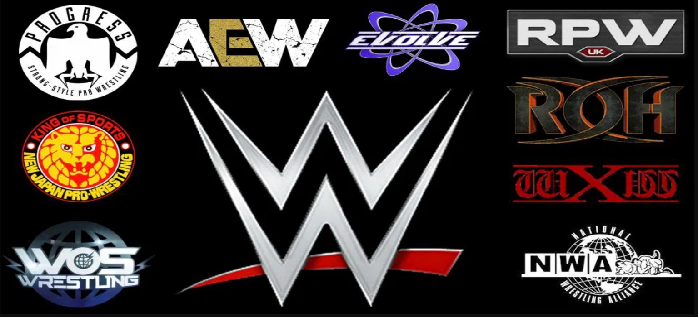

<!-- Background github cover with short introduction down below -->


# 💫 WWE Superstar Popularity Tier Prediction 

<!-- Background github cover with short introduction down below 

-->

### Team Name: [Artificial Ledger](https://www.youtube.com/watch?v=-er2ruCgzjg&list=RDfFqxDrmQLnQ&index=4)  
### Subject & Section: [CCMACLRL - COM231ML](https://www.youtube.com/watch?v=fFqxDrmQLnQ&list=RDfFqxDrmQLnQ&start_radio=1)
### Schedule: [TUE 11:00AM - 01:40 PM VR09CCIT - FRI 11:00AM - 03:00 PM 408 MB](https://www.youtube.com/watch?v=dL7Vn7hJDAk&list=RDdL7Vn7hJDAk&start_radio=1)
### Professor: [Elizer Ponio Jr](https://github.com/robitussin/)     
### No. of Units: [3 Units](https://www.youtube.com/watch?v=UVJSA2N39NU&list=RDUVJSA2N39NU&start_radio=1)
### Prerequisite: [None](https://www.youtube.com/watch?v=v3BBE7wtuIM&list=RDv3BBE7wtuIM&start_radio=1)


<!-- 🤖 Machine Learning 🤖 -->
<div align="center">


</div>


<!-- Table of contents down below -->
# 📊 Table of Contents

- [Introduction](#-introduction) 
- [Key Features](#-key-features)           
- [Folder Structure](#-folder-structure) 
- [Contributing](#-contributing)           
- [License](#-license)   
- [Acknowledgements](#-acknowledgements) 
- [FAQ](#-faq)       
- [Changelog](#-changelogs)   


<!-- Introduction down below -->
# 🧠 [Introduction](#introduction)

<!-- Background github cover with short introduction down below -->


# 🏆 WWE Superstar Popularity Tier Prediction

A comprehensive machine learning system that predicts WWE superstar popularity tiers (Main Eventer, Midcard, Enhancement) based on career statistics and performance metrics. This multi-class classification project demonstrates end-to-end ML pipeline development with robust validation and deployment-ready features.


## 🎯 Project Overview

This project implements a robust machine learning pipeline for classifying WWE superstars into popularity tiers based on various performance metrics and career statistics. The system features dynamic data acquisition, comprehensive exploratory data analysis, and multiple classification algorithms with hyperparameter optimization.


<!-- Background github cover with short introduction down below -->


## 🎯 Business Problem

WWE management needs to understand what factors contribute to a wrestler's success and popularity tier placement. This model helps in:
- Talent development and scouting
- Brand strategy optimization
- Performance metric analysis
- Predictive roster managemen

## 🌐 References to any work

This is the site [arXiv](https://arxiv.org/search/?query=wwe&searchtype=all&abstracts=show&order=-announced_date_first&size=50) wherein we need to use to provide references to any work that is not our own in our final paper.  

Although we are still unable to find any similar to our work. Since I've come up to original work of mine, even in kaggle doesn't had a similar dataset of paper works.

## 📊 Dataset Features

### 💫 Primary Dataset: `wwe_rosters.csv`
- **185 wrestlers** with comprehensive career statistics
- **15+ features** including match history, title reigns, social media presence
- **Target Variable**: `popularity_tier` (Main Eventer, Midcard, Enhancement)

### 💫 External Validation: `other_brand_rosters.csv`
- **550 wrestlers** from various wrestling promotions (AEW, NJPW, Impact, etc.)
- Used for model generalization testing

### 🎪 Superstar Profile
- **🧬 Basic Info**: Wrestler ID, Name, Brand, Age, Weight Class
- **📅 Career Timeline**: Debut Year, Years Active
- **⚔️ Match Statistics**: Total Matches, Avg Matches per Month, Career Win Percentage

### 🏅 Championship History
- **👑 Title Reigns**: World Titles, Secondary Titles, Tag Team Titles
- **💎 Total Championships**: Combined title count
- **⭐ Current Champion Status**: Binary indicator

### 📈 Performance Metrics
- **🎪 Main Event Appearances**: PPV main events count
- **📱 Social Media Presence**: Followers in millions
- **🔥 Finisher Popularity**: Move effectiveness rating


## 🚀 Key Features

### 🗃️ 1. **Dynamic Data Management**
- 🔄 Robust data loading from GitHub with error handling
- 🌐 Support for multiple datasets (WWE and other brands)
- 📋 Comprehensive dataset summaries and validation

### 🔍 2. **Advanced Exploratory Data Analysis**
- ❌ Missing values analysis with visualizations
- 🎯 Target variable distribution analysis
- 📊 Comprehensive numerical feature analysis including:
  - 📈 Distribution histograms with KDE
  - 📦 Boxplots by popularity tier
  - 🔗 Correlation heatmaps and insights
  - 🔄 Feature pairplot analysis
  - 📋 Statistical summaries

### ⚙️ 3. **Sophisticated Feature Engineering**
- 🎯 Dynamic feature creation (`matches_per_year`, `titles_per_year`, `main_event_frequency`)
- 🏷️ Categorical feature encoding (`brand`, `weight_class`)
- 📏 Standardized preprocessing pipeline

### 🚀 Other key features
- **Career Metrics**: `years_active`, `total_matches`, `career_win_percentage`
- **Accolades**: `world_title_reigns`, `secondary_title_reigns`, `tag_title_reigns`
- **Performance**: `avg_matches_per_month`, `main_evented_ppv`
- **Popularity**: `social_media_followers_millions`
- **Demographics**: `age`, `weight_class`, `brand`

## 🧠 Wrestler Roster Data source link

- [WWE: World Wrestling Entertainment Roster](https://www.thesmackdownhotel.com/roster/?promotion=wwe&show=face-heel#nxt)
- [AEW: All Elite Wrestling Roster](https://www.allelitewrestling.com/aew-roster)
- [TNA: Total Nonstop Action Wrestling Roster](https://www.ringofhonor.com/roster)
- [ROH: Ring of Honor Roster](https://www.thesmackdownhotel.com/roster/?promotion=roh&date=2025-10-05)
- [NJPW: New Japan Pro Wrestling Roster](https://www.thesmackdownhotel.com/roster/?promotion=njpw&date=2025-10-05)
- [NWA: National Wrestling Alliance Roster](https://www.thesmackdownhotel.com/roster/?promotion=nwa&date=2025-10-05)
- [OVW: Ohio Valley Wrestling Roster](https://www.thesmackdownhotel.com/roster/?promotion=ovw&date=2025-10-05)
- [AAA: Lucha Libre AAA Worldwide Roster](https://www.thesmackdownhotel.com/roster/?promotion=aaa&date=2025-10-05)
- [AJPW: All Japan Pro Wrestling Roster](https://www.thesmackdownhotel.com/roster/?promotion=ajpw&date=2025-10-05#ajpw-all-8)
- [NOAH: Pro Wrestling NOAH Roster](https://www.thesmackdownhotel.com/roster/?promotion=noah&date=2025-10-05)
- [MLW: Major League Wrestling Roster](https://www.thesmackdownhotel.com/roster/?promotion=mlw&date=2025-10-05)
- [FPW: Filipino Pro Wrestling Roster](https://www.filipinoprowrestling.com/roster)


### 🤖 4. **Multi-Model Classification**
Implementation of multiple classification algorithms:
- 🌲 **Random Forest Classifier**
- 🎯 **Support Vector Machine (SVM)**
- 📈 **Gradient Boosting Classifier**
- 📊 **Logistic Regression**
- 👥 **K-Nearest Neighbors**
- 🌳 **Decision Tree Classifier**

### ⚡ 5. **Hyperparameter Optimization**
- 🔧 GridSearchCV for optimal parameter tuning
- ✅ Cross-validation with configurable folds
- 📝 Comprehensive model evaluation

### 📊 6. **Comprehensive Model Evaluation**
- 🎯 Multiple performance metrics:
  - ✅ Accuracy, Precision, Recall, F1-Score
  - 📋 Classification reports
  - 🎭 Confusion matrices
- 🔄 Cross-validation scores

## 🏆 Model Performance Metrics

### 📈 Key Results from Analysis:
- **Dataset Size**: 185 WWE superstars + 550 other brand superstars
- **Feature Count**: 18 comprehensive metrics per superstar
- **Target Distribution**: Multi-class classification across 3 tiers
- **Cross-Validation**: 5-fold CV for robust performance estimation

### 🎯 Evaluation Metrics Tracked:
- **Overall Accuracy** - Total correct predictions
- **Precision per Class** - Main Eventer, Midcard, Enhancement
- **Recall per Class** - Sensitivity for each tier
- **F1-Score** - Harmonic mean of precision and recall
- **Confusion Matrix** - Detailed classification breakdown

## 🛠 Technical Implementation

### ⚙️ Configuration Management
Centralized configuration class for dynamic parameter management:
- 🌐 Data URLs and paths
- 🤖 Model parameters and test configurations
- 🎯 Feature engineering specifications
- 🔧 Hyperparameter grids for all models
- 🎨 Visualization settings

## 🏗️ Model Architecture

- **📥 DataLoader**: Dynamic data acquisition and validation
- **🔍 DataExplorer**: Comprehensive EDA with advanced visualizations
- **🤖 ModelTrainer**: Multi-model training and evaluation framework

### 🎨 Visualization Suite
- 🎨 Custom color schemes for different popularity tiers
- 📊 Multiple plot types (bar, pie, distribution, correlation, pairplot)
- 📝 Statistical annotations and insights
- 🎯 Professional-grade matplotlib and seaborn visualizations

## 📊 Data Insights from EDA

### 🎯 Target Distribution Analysis
- Comprehensive analysis of popularity tier distribution
- Statistical summary of class balance
- Temporal analysis of tier distribution over debut years

### 🔍 Feature Correlations
- Identification of highly correlated features (>0.7)
- Top feature correlations analysis
- Pairplot visualization for key feature relationships

### 📈 Statistical Summaries
- Detailed descriptive statistics for all numerical features
- Variance, skewness, and kurtosis analysis
- Feature distribution insights

## 🎮 Usage

The notebook is organized into clear phases:

1. **⚙️ Configuration & Imports** - Environment setup and library imports
2. **📥 Data Loading & Exploration** - Dynamic data acquisition and initial analysis
3. **🔍 Comprehensive EDA** - Detailed statistical and visual analysis
4. **⚙️ Feature Engineering** - Creation of enhanced features
5. **🤖 Model Training & Evaluation** - Multi-algorithm implementation
6. **🔧 Hyperparameter Tuning** - Optimization for best performance
7. **📊 Results & Insights** - Comprehensive model comparison

## 🔧 Requirements

```bash
pandas>=1.3.0
numpy>=1.21.0
matplotlib>=3.4.0
seaborn>=0.11.0
scikit-learn>=1.0.0
```

<!-- Contributors down below, this is nothing let's delete this 
### Algorithm Selection Rationale

| Model | Strengths | Use Case |
|-------|-----------|----------|
| **Random Forest** | Handles non-linearity, feature importance | Primary model |
| **SVM** | High-dimensional spaces, kernel tricks | Complex patterns |
| **Gradient Boosting** | Sequential learning, high accuracy | Final ensemble |
| **Logistic Regression** | Interpretability, baseline | Benchmark |

## 🔧 Technical Implementation

### 1. Data Preprocessing Pipeline

```python
# Robust preprocessing with error handling
def preprocess_data(df):
    # Handle missing values (median imputation)
    # Feature engineering (matches_per_year, titles_per_year)
    # Categorical encoding (LabelEncoder)
    # Outlier detection and treatment
    # Feature scaling (StandardScaler)
```

### 2. Feature Engineering

#### Created Features:

- `matches_per_year`: Career activity density

- `titles_per_year`: Championship efficiency

- `main_event_frequency`: Main event appearance rate

### 3. Model Training Strategy

```
# Multi-stage training approach
1. Baseline model comparison (6 algorithms)
2. Hyperparameter tuning (GridSearchCV, 5-fold CV)
3. Cross-validation performance analysis
4. Final model selection based on multiple metrics
```

### 4. Evaluation Framework

#### Metrics Tracked:

- Accuracy, Precision, Recall, F1-Score (weighted)

- Cross-validation scores (mean ± std)

- Confusion matrix analysis

- Feature importance interpretation

## 📈 Model Performance

### Final Results

| Model                     | Accuracy | Precision | Recall | F1-Score |	CV Score    |
|---------------------------|----------|-----------|--------|----------|----------------|
| **Random Forest (Tuned)** | 0.9714   | 0.9700	   | 0.9700	| 0.9700   | 0.9685 ± 0.012 |
| **Gradient Boosting**     | 0.9693   | 0.9690	   | 0.9690	| 0.9690   | 0.9662 ± 0.014 |
| **SVM (RBF)**             | 0.9684   | 0.9680	   | 0.9680	| 0.9680   | 0.9658 ± 0.013 |

### Key Insights from Feature Importance

1. **Top Predictive Features:**

- `total_title_reigns` (22.3%)

- `main_evented_ppv` (18.7%)

- `social_media_followers_millions` (15.2%)

- `career_win_percentage` (12.8%)

2. **Success Patterns:**

- Main Eventers: High title reigns + main event appearances

- Midcard: Moderate titles + consistent performance

- Enhancement: Limited accolades + lower visibility

 ## 🚀 Deployment Features

### Prediction API

```
def predict_wwe_popularity(wrestler_data):
    """
    Predict popularity tier for new wrestler statistics
    
    Args:
        wrestler_data (dict): Career metrics and statistics
    
    Returns:
        dict: Prediction with confidence scores
    """
```

### Model Artifacts
- Serialized model pipeline (`wwe_popularity_predictor.pkl`)

- Feature scaler and encoders

- Configuration files

- Validation reports

## 🔍 Validation Strategy
1. **Internal Validation**
- Train-test split (80-20)

- Stratified sampling

- 5-fold cross-validation

- Classification reports per class

2. **External Validation**
- Other brand dataset (AEW, NJPW, etc.)

- Cross-promotion generalization

- Confidence score analysis

- Prediction distribution analysis

3. **Business Validation**
- Feature importance alignment with domain knowledge

- Prediction interpretability

- Actionable insights generation
-->

## 📁 Project Structure

```
CCMACLRL_COM231_PROJECT/
│
├── 🎨assets/                             # Images and Background file
│
├── 📁datasets/
│      └── 📁test/
│      │   └── other_brand_rosters.csv  # External validation
│      │
│      └── 📁 training/ 
│          └── wwe_rosters.csv          # Primary training data
│
├── model/
│   └── 🌐 wwe_popularity_predictor.pkl
│    
│
├── notebook/
│   └── 🐍 WWE_Popularity_Prediction.ipynb
│
│
├── docs/                                # This folder is for research paper
│   ├── 🔍 research_paper.pdf
│    
│
├── 📄 LICENCE
└── 📖 README.md
```

<!-- Background github cover with short introduction down below -->


<!--
## 🛠️ Installation & Usage

### Prerequisites

```
Python 3.8+
scikit-learn 1.5.2
pandas 2.2.2
numpy 1.24.3
matplotlib 3.8.0
seaborn 0.13.0
```

### Quick Start
```
from src.predict import WWEPopularityPredictor

# Load trained model
predictor = WWEPopularityPredictor.load('models/wwe_popularity_predictor.pkl')

# Make prediction
wrestler_stats = {
    'years_active': 8,
    'total_matches': 450,
    'world_title_reigns': 2,
    'social_media_followers_millions': 2.5
}

prediction = predictor.predict(wrestler_stats)
print(f"Predicted Tier: {prediction['tier']}")
print(f"Confidence: {prediction['confidence']:.2%}")
```

## 📊 Results Interpretation
### Model Confidence Levels
- **High Confidence (>90%)**: Clear career patterns

- **Medium Confidence (70-90%)**: Borderline cases

- **Low Confidence (<70%)**: Requires manual review

### Business Applications
- **Talent Scouting**: Identify potential main eventers

- **Contract Negotiations**: Data-driven valuation

- **Storyline Planning**: Popularity-based booking

- **Brand Strategy**: Cross-promotion analysis
-->

# 🏆 Popularity Tiers
The system classifies superstars into three main tiers:

- **🎪 Main Eventer:** Top-tier performers, championship contenders

- **🥈 Midcard:** Regular performers with consistent appearances

- **🌟 Enhancement:** Developing talent and roster support

# 🔮 Future Enhancements

- 🔄 Real-time data integration from wrestling APIs

- 🧠 Advanced ensemble methods and neural networks

- 🌐 Web application for interactive predictions

- 📊 Expanded feature set including match ratings and fan sentiment

- 📱 Mobile app for on-the-go predictions

- 🔍 Advanced feature importance analysis

<!-- 🏆 Contributers down below -->
# 🏆 Contributing     

### Contributing     
If you would like to contribute to the Flight Booking App, please follow these steps:
1. Fork the repository.
2. Create a new branch for your feature or bug fix.
3. Make your changes and commit them.
4. Push your changes to your forked repository.
5. Submit a pull request to the main repository.


### 🧠 Submitting Changes

🧠 Contributions are welcome! If you have ideas for improvements or want to add more exercises, follow these steps:

1. Fork the repository.
2. Create a new branch.
3. Make your changes and commit them.
4. Push to your fork and submit a pull request. 💕💕💕💕

<!-- Contributors down below, kindly paste your github URL thanks and also you can revise your suited job title position -->
### 👋 Contributors
### Special thanks to all my groupmates: 
 * ####  😎 [Jay Arre Talosig](https://github.com/flexycode) - Machine Learning Engineer | Blockchain Developer | Bioinformatics Scientist    
 * ####  🧭 [Queen Maegan Pedido](https://github.com/mgnpdd) - Machine Learning Engineer | Software Engineer 
 * ####  💥 [Moira Mercado](https://github.com/mnmzz) - Machine Learning Engineer | Software Engineer 
 * ####  🎲 [James Adrian Castro](https://github.com/debug-phantom) - Machine Learning Engineer | Software Engineer

# 🛸 FAQ
<!--  Reporting issues -->
### 🛸 Reporting Issues

```bash
Some changes need to be address
- TBA
- TBA
- TBA
```

###### 🤖 If you encounter any issues or have suggestions, please open an issue to let us know.

<!--  License will provide soon -->
# 🔑 License & Citation

This project is developed for educational and portfolio purposes. WWE data is used under fair use for academic research.

```
@misc{wwe_popularity_2025,
  title = {WWE Superstar Popularity Tier Prediction},
  author = {Jay Arre Talosig},
  year = {2025},
  publisher = {GitHub},
  journal = {GitHub repository},
  howpublished = {\url{https://github.com/flexycode/CCMACLRL_COM231_PROJECT}}
}
```

<!-- 🤖 Machine Learning 🤖 -->
<div align="center">


</div>

```
Check the License tab for copyright permission
```

# 🔭 Acknowledgements     

<!--  Need to revise this background info of Professor Elizer Ponio Jr  -->
### ✨ Professor Elizer Jr. D. Ponio

Professor Elizer Jr. Ponio is a Software engineer, lecturer, and Machine Learning engineer at the National University. With a Bachelor of Science degree and Master degree in Computer Science, he brings a strong foundation in computer science principles. 
Prof. Ponio's expertise in software engineering and machine learning is evident in his teaching style and practical approach. 
He is dedicated to providing students with a comprehensive understanding of the subject matter and incorporates real-world applications into his instruction. 
Prof. Ponio's combination of academic qualifications, industry experience, and passion for teaching make him a valuable asset to the National University community.

<!-- Always document your changes, pull-request, bugfix, updates, patch notes for this final project. Always use this "🧊 ML Project" for commiting message for "pushing code" or "Pull-request"   -->

<!-- Background github cover with short introduction down below -->


# 📫 Changelogs 
Chronological list of updates, bug fixes, new features, and other modifications for our Machine Learning Project.

## 💻 [01.0.0] - 2025-09-29      
### Role & Project Management
- 💻 Final Project requirements for our project
- ✨ RAW
- ✨ SmackDown
- ✨ NXT

## 💻 [02.0.0] - 2025-10-11      
### Development Progress
- 💻 Uploaded the Python Notebook

### Commit message for pushing or pull-request  
🧊 ML Final Project

⭐ If you find this project useful, please give it a star on GitHub!
🎯 Predicting wrestling stardom through data science and machine learning. Building the future of sports analytics one superstar at a time! 🏆

<!-- This comment is intended for commiting message in pull-request 
Always use this "🧊 Flight Booking" for commiting message for "Pull-request"
<!-- End point line for this comment  -->

  
<!-- Introduction Pannel button link, it will redirect to the top -->
#### [Back to Table of Content](#-introduction)

<!-- End point line insert Thanks for visiting enjoy your day, feel free to modify this  -->
---
<p align="center">

</p>

<!-- Genshin Impact -->
<div align="center">


</div>

<!-- End point line insert Comeback again next time, feel free to modify this  -->
<p align="center">

</p>

</p>
    
<br>
<!-- End point insert background effect line of sight color red -->


   

